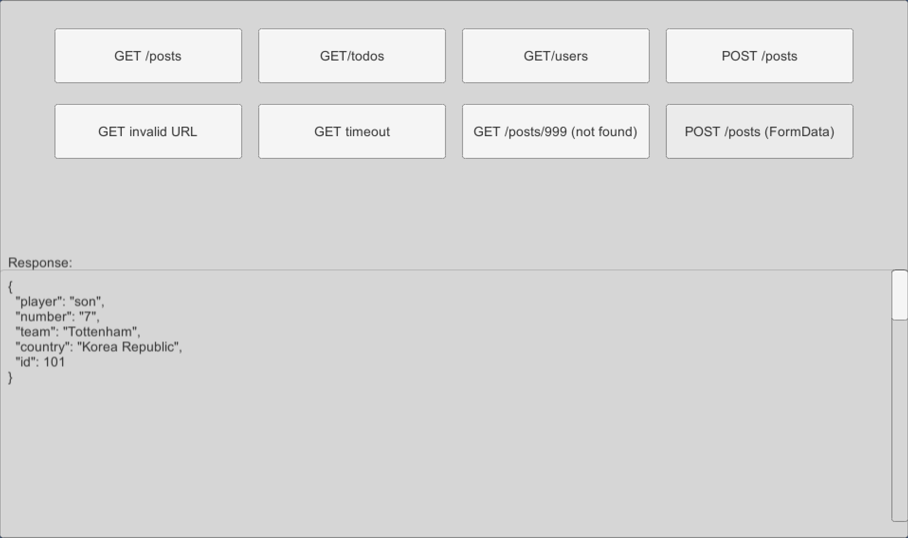

# simple-http-client-unity

Provide efficient HttpClient functions using UniTask in Unity.

## Features

* using [UniTask](https://github.com/Cysharp/UniTask)
* using UnityWebRequest, UnityWebRequestTexture
* Success, error and network error events
* GET, POST, PUT, DELETE, HEAD
* Provide various examples

## Screenshot




## Installation

There are 4 ways to install this plugin:

- import UniHttpClient.unitypackage via Assets-Import Package
- (via Package Manager) add the following line to Packages/manifest.json:
    + `"com.coolishbee.http-client":` `"https://github.com/coolishbee/simple-http-client-unity.git",`
- (via OpenUPM) after installing openupm-cli, run the following command:
    + `openupm add com.coolishbee.http-client`

## Example
### GET Example

```c#
string requestURL = "http://localhost:8000" + "/api/path";

var req = SimpleHttpClient.Get(requestURL)
    .OnSuccess(res => Debug.Log(res.Text))
    .OnError(err => Debug.LogWarning(err.Error))
    .OnNetworkError(netErr => Debug.LogError(netErr.Error))
    .Send();
```

### POSTJson Example

```c#
var team = new TeamInfo_Req("Chelsea", "Graham Potter", "3:4:2:1");

string requestURL = "http://localhost:8000" + "/api/path";

var req = SimpleHttpClient.PostJson(requestURL, JsonUtility.ToJson(team))
    .OnSuccess(res => Debug.Log(res.Text))
    .OnError(err => Debug.Log(err.Error))
    .OnNetworkError(netErr => Debug.LogError(netErr.Error))
    .Send();
```

### POSTFormData Example

```c#
string requestURL = basePath + "/posts";

WWWForm form = new WWWForm();
form.AddField("player", "son");
form.AddField("number", "7");
form.AddField("team", "Tottenham");
form.AddField("country", "Korea Republic");

var req = SimpleHttpClient.Post(requestURL, form)
    .OnSuccess(res =>
    {
        responseText.text = res.Text;
    })
    .OnError(err => Debug.LogWarning(err.Error))
    .OnNetworkError(netErr => Debug.LogError(netErr.Error))
    .Send();
```
